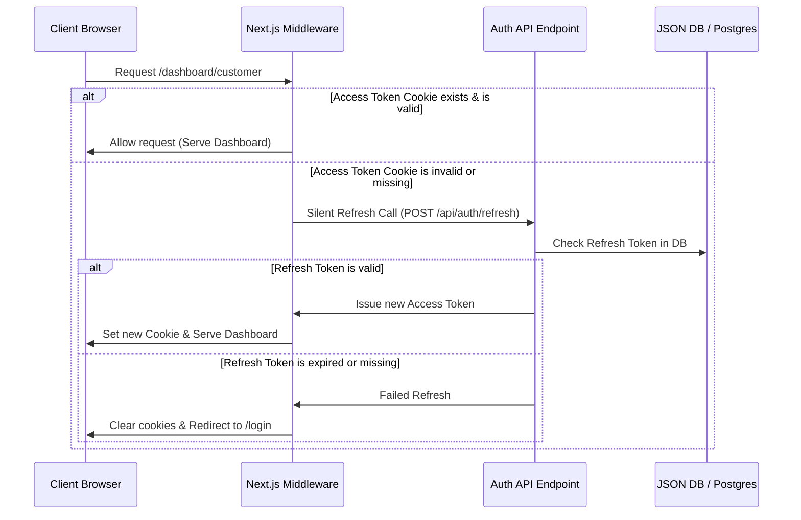

# System Architecture Overview — ApnaDoodh Marketplace

This document outlines the technical design, system layout, data flows, and security mechanics of the ApnaDoodh marketplace.

---

## 1. Technology Stack

* **Frontend Framework**: Next.js 15 (App Router, Server & Client Components)
* **Styling**: Tailwind CSS v4 (native `@theme` configurations, mobile-first grid, CSS shimmers)
* **Database & ORM**: Prisma ORM with PostgreSQL database schema support
* **Local Fallback Database**: In-memory write-locked JSON database (`auth_db.json`)
* **Caching & Queue**: Redis (ioredis) with in-memory TTL map fallback for local development
* **Payments**: Stripe & Razorpay SDK integrations
* **SMS Gateway**: Twilio SMS (orMsg91)
* **Email Gateway**: SendGrid Mail (or Resend)
* **Maps / Geocoding**: Google Maps API

---

## 2. Directory Structure & Layers

```text
├── app/                        # Next.js App Router Pages & API Route Handlers
│   ├── api/                    # Backend API endpoints (Auth, Customer, Admin, etc.)
│   ├── dashboard/              # Branded Admin, Customer, and Farmer Dashboards
│   ├── products/               # Marketplace catalogue and dynamic product specs
│   ├── loading.tsx             # Root skeleton shimmer page loader
│   ├── not-found.tsx           # Custom 404 handler
│   └── error.tsx               # Root React exception boundaries
├── components/                 # Reusable UI modules & Section Layouts
│   ├── about/                  # Inside story timelines and member components
│   ├── Navbar.tsx              # Navigation menu with auth states
│   └── CartProvider.tsx        # React Context tracking local storage shopping carts
├── lib/                        # Core Application Engine & Helpers
│   ├── db.ts                   # Core database queries and write locks queue
│   ├── jwt.ts                  # Web Crypto JWT token encoders/decoders
│   ├── queue.ts                # In-memory background task workers registry
│   ├── redis.ts                # Cache abstraction with memory TTL map fallback
│   ├── security.ts             # Input sanitizers, CORS headers, rate limit maps
│   ├── services.ts             # Third-party integrations (Stripe, Twilio, S3 geocoding)
│   └── repositories/           # Repository Pattern separation layers
├── public/                     # Compressed WebP assets and local uploads folder
└── prisma/                     # Prisma schema definitions
```

---

## 3. Core Architectural Flows

### 3.1. Authentication & Middleware Verification


### 3.2. Wallet Debit & Refund Escrow
* **Top-Up**: Payments are completed via Stripe/Razorpay (`lib/services.ts`). Upon success, a transaction document is pushed, and the user's `walletBalance` is incremented.
* **Subscription Billing**: Daily drops are scheduled and debited against the customer's wallet balance.
* **Skip & Auto-Refund Escrow**: If a drop status is skipped (via `/api/customer/deliveries/[id]/skip`):
  1. The delivery item's status transitions to `Skipped`.
  2. The system executes `updateDeliveryStatus` (`lib/db.ts`) which triggers the escrow module.
  3. The cost of the skipped drop is credited back to the customer's `walletBalance`.
  4. A `CREDIT` ledger transaction log is recorded.

### 3.3. Write Queue (Concurrency Safety)
To prevent race conditions during concurrent JSON database writes, all modifications run inside a promise chain (`runInQueue` in `lib/db.ts`):
```typescript
let writeQueue = Promise.resolve();
async function runInQueue<T>(fn: () => Promise<T>): Promise<T> { ... }
```
This forces sequential write lock execution, ensuring data consistency.

---

## 4. Security Architecture

* **Rate Limiting**: sliding-window IP requests tracked in memory or Redis cache block logins after 5 attempts/minute.
* **Sanitization**: Recursively strips HTML `<script>` tags (XSS protection) and escapes quotes (SQLi protection) on incoming JSON request payloads.
* **CORS Policies**: Strict Origin matching allowing access only to specified frontends or local environments.
* **Document Locking**: KYC files uploaded to private S3 buckets are never directly accessible; the system issues short-lived pre-signed URLs (5-minute expiry).
