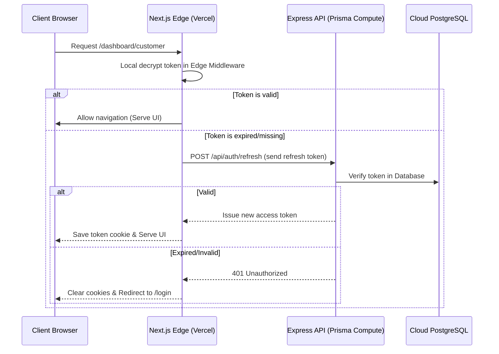

# System Architecture Overview — ApnaDoodh Marketplace

This document outlines the decoupled single-backend technical architecture, system layout, data flows, and security mechanics of the ApnaDoodh marketplace.

---

## 1. System Topology

ApnaDoodh uses a modern decoupled architecture consisting of a static/UI frontend and a central API backend.

```text
       Frontend (Next.js 15)
     [ Deployed on Vercel UI ]
                 │
                 │ HTTPS API Calls (apiFetch)
                 ▼
     Backend (Node.js + Express)
  [ Deployed on Prisma Compute ]
                 │
                 │ Prisma ORM Client
                 ▼
  PostgreSQL Cloud Database
```

* **Frontend**: Next.js 15 UI pages and middleware only. It contains no database dependencies and runs entirely as static/client-side application, calling the Express backend for all operations.
* **Backend**: Express.js server exposing REST endpoints. It holds all business logic, ORM database connections, third-party integrations, and background task queues.
* **Database**: Managed Cloud PostgreSQL synced using Prisma ORM.

---

## 2. Technology Stack

* **Frontend Framework**: Next.js 15 (App Router, Client Components, Edge Middleware)
* **Backend Framework**: Node.js + Express.js (TypeScript compiled)
* **Database & ORM**: Prisma ORM with PostgreSQL database cloud schema
* **JWT Cryptography**: Edge-native Web Crypto APIs (Frontend) & native Node Crypto Hmac (Backend)
* **Background Queue**: In-memory task worker queue (running in Express backend)
* **Payments**: Stripe & Razorpay SDK integrations
* **SMS Gateway**: Twilio SMS (or Msg91 API)
* **Email Gateway**: SendGrid Mail (or Resend API)
* **Maps / Geocoding**: Google Maps API

---

## 3. Directory Layouts

### 3.1. Frontend Directory (`/`)
```text
├── app/                        # Next.js App Router (UI Pages & Layouts only)
│   ├── dashboard/              # Branded Admin, Customer, and Farmer Dashboards
│   ├── products/               # Marketplace catalogue UI pages
│   ├── login/                  # Customer/Farmer login page
│   ├── signup/                 # Registration page
│   ├── loading.tsx             # Root skeleton shimmer page loader
│   ├── not-found.tsx           # Custom 404 handler
│   └── error.tsx               # Root React exception boundaries
├── components/                 # Reusable UI modules & Section Layouts
├── lib/                        # Client Utilities
│   ├── api-client.ts           # Centralized apiFetch wrapper pointing to NEXT_PUBLIC_API_URL
│   └── jwt.ts                  # Edge-native JWT validator for Middleware
├── public/                     # Compressed WebP assets
├── middleware.ts               # Next.js Edge Middleware for routing controls
├── package.json                # Frontend package configuration (database-free)
└── tsconfig.json               # Frontend TypeScript configuration
```

### 3.2. Backend Directory (`/backend/`)
```text
├── src/
│   ├── server.ts               # Express bootstrap entry point (CORS, Middlewares, Static server)
│   ├── routes/                 # Express API Controller routers
│   │   ├── auth.ts             # Sign-up, login, refresh tokens, profiles
│   │   ├── products.ts         # Products retrieval, catalog uploads
│   │   ├── deliveries.ts       # Schedules, skips, temperature logging
│   │   ├── wallet.ts           # Top-ups, ledgers, invoice listings
│   │   ├── reviews.ts          # Moderation logs, review inserts
│   │   ├── admin.ts            # Payout runs, KYC status, audit listings
│   │   └── tracking.ts         # Telemetry location updates
│   └── lib/                    # Shared Libraries
│       ├── db.ts               # Prisma ORM instantiation and DB seeding
│       ├── jwt.ts              # Node Crypto JWT signer/verifier
│       ├── queue.ts            # Background roster generation task queue
│       ├── security.ts         # Request rate-limiters and input sanitizers
│       └── services.ts         # Integrations (Stripe, Razorpay, S3, Twilio)
│       └── repositories/       # Clean Repository Pattern layers
├── prisma/                     # Prisma schema definition
├── package.json                # Backend dependency and run scripts
└── tsconfig.json               # Backend TypeScript compiler configuration
```

---

## 4. Core Architectural Flows

### 4.1. Decoupled Token Authentication Flow


### 4.2. Escrow Wallet Billing & Auto-Refund Flow
* **Subscription Top-Up**: User triggers a wallet credit. Express processes payment via Stripe/Razorpay (`lib/services.ts`), writes the transaction ledger to Postgres, and increments `walletBalance`.
* **Escrow Debits**: Daily drops are scheduled and debited against the customer's wallet balance.
* **Skip & Auto-Refund Escrow**: If a drop status is updated to `Skipped` (via PATCH `/api/deliveries/:id`):
  1. The Express server initiates a database transaction (`prisma.$transaction` in `lib/db.ts`).
  2. The delivery item status is flagged as `Skipped`.
  3. The price of the delivery item is added back to the customer's `walletBalance`.
  4. A `CREDIT` transaction record is logged as "Auto-Refund: Skipped drop".
  5. The transaction commits atomically, avoiding race conditions.

---

## 5. Security Systems

* **Rate Limiting**: sliding-window IP requests tracked in memory or Redis cache block logins after 5 attempts/minute.
* **Request Sanitization**: The backend recursively strips HTML `<script>` tags (XSS protection) and escapes quotes (SQLi protection) on incoming JSON payloads.
* **CORS Policies**: Strict Origin matching allowing access only to specified frontends or local environments.
* **Document Locking**: KYC files uploaded to private S3 buckets are never directly accessible; the system issues short-lived pre-signed URLs (5-minute expiry).
